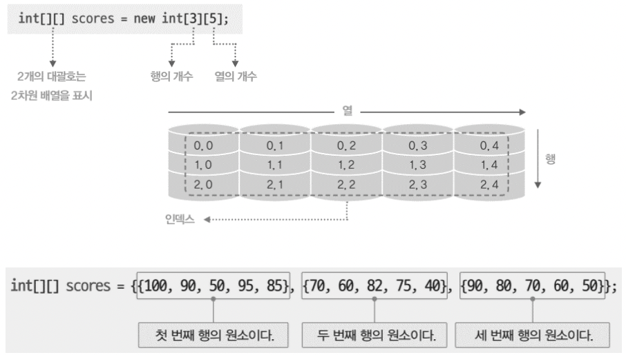

# Lecture 7-8

# Lecture 7: 문자열과 배열

## 🧑🏻‍💻배열(Array)

: 여러 데이터를 하나로 묶은 것 —> 자료형의 집합

: 자료형 타입 바로 옆에 `[]` 기호를 사용하여 표현

```java
int[] scores = { 88, 98, 68, 72, 47 };
```

레퍼런스 변수: 정수가 저장된 배열을 가리키는 것

## 🧑🏻‍💻배열의 특징

1. 배열의 값은 모두 같은 데이터 타입
ex) 정수형 배열에는 정숫값, 실수형 배열에는 실숫값만 담겨야 함

```java
int[] points = { 10, 7, 9, 9 }; // 모두 정수
double[] weights = { 68.3, 82.1, 52.7, 58.9 }; // 모두 실수
```

1. 배열 속 데이터는 *인덱스로 구분
*인덱스(index): 배열 공간을 번호로 구분한 것, 0부터 시작 
2. 배열은 한 번 만들어지면 그 길이가 변하지 않음
-배열의 길이는 length 키워드를 통해 가져올 수 있음

```java
boolean[] flags = { true, false, false, true }; // 4개의 논릿값을 담는 배열
System.out.print(flags.length); // 4 출력
```

## 🧑🏻‍💻배열 생성

### 초기화를 통한 생성

: 중괄호 안에 초깃값을 명시하여 만드는 방법

```java
int[] scores = { 88, 98, 68, 72, 47 }; // 정수형 배열을 가리키는 변수, 쉼표로 구분된 배열의 초깃값들
```

### 길이 지정을 통한 생성

: new 키워드와 배열의 타입, 길이 정보를 명시

```java
double[] grades = new double[4]; // 실수형 배열을 가리키는 변수, 길이가 4인 실수형 배열을 생성
```

-배열의 초깃값은 모두 0.0

-길이를 지정하여 만든 배열은 타입에 따라 초깃값 결정
    >> 정수형 배열(0), 실수형 배열(0.0), 논리형 배열(false), 문자열 배열(null)

## 🧑🏻‍💻배열 활용

### 메소드로 배열 전달하기

: 배열은 메소드의 입력변수로 전달될 수 있음

```java
public static void main(String[] args) {
	int[] points = { 1, 3, 1, 8 };
	int result = average(points); // 메소드 호출
}
```

-배열을 전달 받기위해서는 입력변수 또한 points와 같은 타입인 int[] 이어야 함

-메소드 호출이 이뤄지면 points의 배열 위치 정보는 입력변수 arr로 대입됨 —> 두 변수는 같은 배열을 가리킴

```java
public static int average(int[] arr) { // int[] arr --> 정수 배열을 가리킬 변수
	...
}
```

### 문자열과 배열

: 문자열은 toCharArray() 메소드를 통해 문자의 배열로 바뀔 수 있음

```java
String str = "ABCD";
char[] charArr = str.toCharArray();
			// char[] charArr = { 'A', 'B', 'C', 'D' };와 같음
```

cf) 문자란 한 글자를 의미하는 타입으로, char로 표기

```java
char ch = 'A';
char ch2 = 'ABC'; // ERROR
```

## 🧑🏻‍💻다차원 배열

### 이차원 배열

: 기본 배열(일차원 배열)을 묶어 새로운 배열을 이루는 형태



```java
int[] row1 = { 1, 2, 3, 4 };
int[] row2 = { 5, 6, 7, 8 };
int[][] matrix = { row1, row2 };
```

### 삼차원 배열

: 이차원 배열을 묶어 만든 배열

## 🧑🏻‍💻동적 배열

: 처리할 데이터의 개수가 고정된 경우가 아닐 때 Java는 크기가 유동적인 배열을 지원하기 위하여 ArrayList 클래스를 제공

### ArrayList 객체 생성

```java
ArrayList<참조타입> 참조변수 = new ArrayList<>();
```

### ArrayList 원소 접근

```java
참조변수.add(데이터) // 데이터를 동적 배열에 원소로 추가
참조변수.remove(인덱스번호) // 동적 배열에서 인덱스 번호의 원소를 제거
참조변수.get(인덱스번호) // 동적 배열에서 인덱스 번호의 원소를 가져오기
참조변수.size() // 동적 배열에 포함된 원소 개수
```

# Lecture 8: 객체지향과 절차적 프로그래밍

## 🧑🏻‍💻절차적 프로그래밍(Procedural Programming, PP)

대표 언어: C언어

- 함수 위주의 구조화된 방식
- main()함수에서 출발하여 그 안의 내용을 순차적으로 실행하는 방식
- 함수를 중심으로 프로그램을 설계한 후 거기에 필요한 데이터를 정의
- 명령어의 순서와 흐름에 중점

### 장점

1. 객체나 클래스를 만들 필요 없이 의식의 흐름대로 코딩 가능
2. 필요한 기능을 ‘함수'로 만들어 두기 때문에 같은 코드를 복사 없이 호출하여 사용 가능
3. 프로그램의 ‘흐름’을 쉽게 추적 가능

### 단점

1. 각 코드가 유기적이기 때문에 수정하기가 어려움 
>> 프로그램 전체에서 코드 재사용 불가 >> 개발 비용, 시간 증가
2. 디버깅(에러 검사)이 어려움

## 🧑🏻‍💻객체지향 프로그래밍(Object-oriented Programming, OOP)

대표 언어: Java, C#, Python, C++ 등

- 프로그램이 순차적으로 실행되지 않음

### 장점

1. 모듈화, 캡슐화로 인해 유지보수에 용이
2. 현실 세계와 유사성에 의해 코드를 이해하기 쉽게 만듦
3. 다른 프로그램에서 재사용 가능 >> 높은 코드 재사용성과 확장성

### 단점

1. 일반적으로 속도가 상대적으로 느려지고 많은 양의 메모리 사용
2. 현실 세계와 유사성에 의해 코드를 이해하기 쉽게 만들기 위해 설계 과정이 오래 걸림

- 객체

개념: 소프트웨어 객체는 상태를 필드(Field)로 정의하고, 동작을 메소드(Method)로 정의

클래스 —> 객체의 설계도

객체 —> 클래스를 토대로 만들어진 프로그램의 실제 구성 요소

- 추상화

: 현실 세계의 객체에서 불필요한 속성을 제거하고 중요한 정보만 클래스로 표현하는 모델링 기법