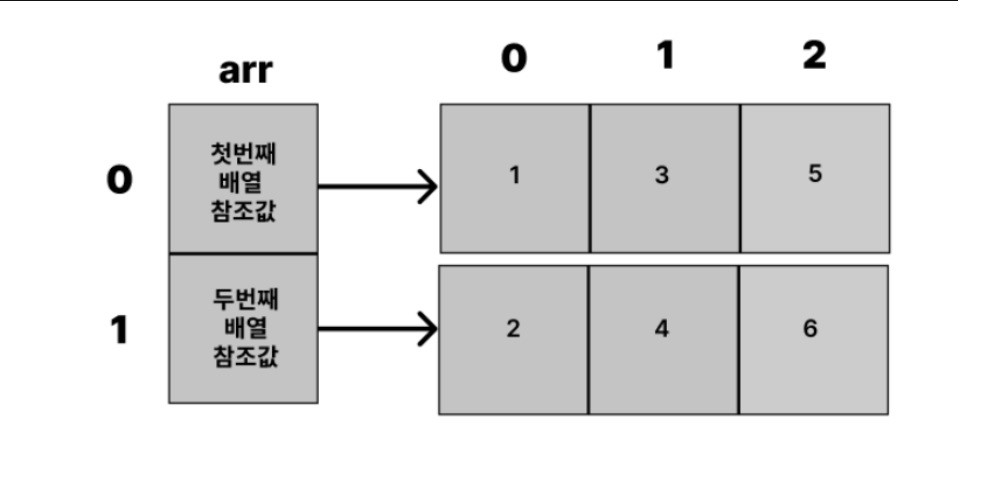

# ☕ 배열
동일한 자료형(Data Type)의 데이터를 연속된 공간에 저장하기 위한 자료구조이다.
즉, 연관된 데이터를 그룹화하여 묶어준다고 생각하면 된다.
배열은 크게 1차워 배열과 다차원 배열, 두 가지로 나뉠 수 있다.
배열을 활용하면 모든 값을 하나의 변수에 넣을 수 있다.
배열은 선언할 때 크기를 지정해야 하고, __나중에 변경할 수 없다. 또 배열 안 모든 데이터는 동일한 자료형이어야 한다.__

## 📌 배열의 선언
```
• 자료형[] 배열 이름 = new 자료형[개수]
• 자료형 배열 이름[] = new 자료형[개수]
```
```java
// 크기 할당 & 초기화 없이 선언하는 경우
int[] arr;
int arr[];
```
위의 예시에서 arr은 배열의 시작위치만 저장하고 있는 변수 입니다. 아직 배열이 만들어 지지는 않았다.
(참조 타입: 변수에 저장될 때, 주소 값이 저장된다.)

## 📌 배열 초기화하기
자바에서 배열을 선언하면 그와 동시에 각 요소의 값이 초기화된다.

## ✨ default 배열 초기화 값


## ✨ 배열의 길이와 인덱스
배열이름.length로 배열이 가진 요소의 갯수, 배열의 길이를 알 수 있습니다.
```
int[] arr = new int[5];
arr.length //5
```
배열의 길이는 배열의 마지막 인덱스에 +1한 것과 동일합니다.(인덱스가 0부터 시작하기 때문)

## ✨ 배열 초기화의 여러가지 경우
• 선언과 동시에 초기화
```java
int[] arr1 = new int[5]; 

// arr -> {0, 0, 0, 0, 0}
// 배열의 요소에 값을 저장하지 않으면 각 요소는 해당 타입의 기본값으로 자동으로 채워짐.
```
• 선언 후 초기화하는 방식
```java
int[] arr;
arr = new int[5]; 

// arr -> {0, 0, 0, 0, 0}
// 배열의 요소에 값을 저장하지 않으면 각 요소는 해당 타입의 기본값으로 자동으로 채워짐.
```
• 선언과 동시에 값을 넣어 초기화하는 방식, new int[] 부분은 생략 가능하다. 
```java
int[] arr = {1,2,3,4,5};
int[] arr = new int[] {1,2,3,4,5};

// arr -> {1,2,3,4,5}
```
• 하지만 다음과 같이 자료형을 먼저 선언해두고 값을 초기화하는 경우에는 new int[]를 생략할 수 없다.
```java
int arr; //배열 자료형 선언
arr = new int[] {1,2,3}; //new int[] 생략 불가
```
• 값을 넣어 초기화할 때 [] 안에 갯수를 쓰면 오류가 발생한다.
```java
//오류 발생
int[] arr = new int[3] {1,2,3};
```

## 📌 다차원 배열


배열A의 요소로 배열B,배열C,배열D가 존재 함으로써 배열안의 배열로 종 횡을 이루면 2차원 배열이 됩니다. 만약 요소인 배열인 배열B안에 또다른 배열E가 존재한다면 3차원 등으로 차원이 올라갑니다.

## ✨ 다차원 배열 선언과 초기화
```java
//크기 할당 및 초기화 없이 선언만 하는 경우
int[][] arr;

// 3차원 배열을 선언하는 경우
int[][][] arr;

// 선언과 동시에 배열의 크기를 지정한 경우
int[][] arr = new int[2][3];

int[][] arr;
arr = new int[2][3];

// 배열은 아래와 같이 초기화가 됩니다.
// {
//   {0, 0, 0},
//   {0, 0, 0}
// }

// 선언과 동시에 값을 넣어 초기화하는 경우
int[][] arr = {{1,3,5},{2,4,6}};
int[][] arr = new int[][] {{1,3,5},{2,4,6}};
// 배열은 아래와 같이 초기화가 됩니다. 
// {
//   {1, 3, 5},
//   {2, 4, 6}
// }
```
new키워드와 지정된 크기를 사용해서 배열을 선언하면 먼저 지정된 크기만큼 0으로 초기화된 배열을 만들고 그 내부에 두번째 크기만큼 0으로 초기화된 상태의 배열이 만들어진다. 첫번째 배열에서 두번째로 지정된 배열의 참조값으로 두번째 배열에 접근할 수 있다.



위의 사진에서 밖의 배열은 크기를 지정해 줘야하지만 안의 배열은 크기를 지정할 필요가 없는 것을 알 수 있다. (배열의 크기를 지정하지 않아도 선언 가능하다.) 따라서 안의 배열들의 크기를 모두 동일하게 만들 필요 없이 제각각으로 선언할 수 있다.

1부터 100까지의 소수를 제외한 수를 저장하는 2차원 배열을 만든다고 가정하자. 밖의 배열은 10의자리, 안의 배열은 1의자리이다. 각 10의 단위마다 소수의 갯수가 다르므로 안의 배열의 크기는 제각각이다.

```java
int[][] arr = new int[10][]
```

첫번째 배열에는 10이라는 크기를 초기화했지만 그 공간 안에 넣을 배열들은 초기화 하지않고 참조변수를 담을 공간만 할당했다. 메모리가 낭비되는 것을 방지할 수 있다.


## 📌 문자열 배열
배열은 요소의 순서(index)가 있는 값의 묶음이다. 마찬가지로 문자열도 순서가 있는 값의 묶음이다. 문자열 배열을 선언하고 초기화 할 수 있다.

```java
//선언 후 각 배열에 값을 넣어 초기화
String[] str = new String[3];
str[0] = "Hello";
str[1] = "Java";
str[2] = "world";

//선언과 동시에 값을 넣어 초기화
String[] str = new String[] {"Hello","Java","world"};
String[] str = {"Hello","Java","world"}; // new String[] 생략 가능

//한번에 만들기
String str = "Hello Java World";
```

### 💡문자와 문자열을 변수에 담을 때 주의 사항   
* 문자는 ''로 묶지만, 문자열은 ""로 묶어야 한다.
* 문자는 char 데이터 타입으로 지정해야 한다.
* 문자열은 String class 타입으로 지정해야 한다.

## 📌 배열의 길이와 인덱스
배열의 각 요소에 접근하기 위해선 인덱스를 사용한다. 인덱스는 1이 아닌 0부터 시작한다. (길이가 1 더 큰 이유)


```java
int[] arr = {1, 2, 3, 4, 5};
System.out.println(arr[2]); 
// 숫자 3이 출력

arr[2] = 6;
System.out.println(arr[2]); 
// 숫자 6이 출력
```
```java
int[] arr = {1,2,3,4,5};
System.out.println(arr.length);


//2차원 배열
int[][] arr {{1,2,3},{4,5};
System.out.printfln(arr.length);    // 숫자 2가 출력
System.out.printfln(arr[0].length); // 숫자 3이 출력
System.out.printfln(arr[1].length); // 숫자 2가 출력
```
## 📌 반복문을 통한 배열 탐색
for문으로 배열을 탐색
```java
int[] arr = {1, 2, 3, 4, 5};

// for문을 사용한 탐색 경우
for(int i = 0; i < arr.length; i++){
	System.out.println(arr[i]);

// for-each문을 사용한 탐색 경우
for (int num: arr) {
	System.out.println(num);
}
```
주의해야 할점은 for문은 값을 읽어들이는 것, 할당하는 것 둘다 가능하지만, for-each문은 값을 읽어들이는 것만 가능합니다.
```java
int[] arr1 = {1, 2, 3, 4, 5};

// 일반적인 for문은 arr1이 가진 요소의 값을 재 할당할 수 있습니다.
for(int i=0;i<arr1.length;i++){
	arr1[i] += 1;
}

// arr1 출력 결과 : {2,3,4,5,6}
for(int i=0;i<arr1.length;i++){
	System.out.printf("%d",arr1[i]);
}

int[] arr2 = {1, 2, 3, 4, 5};

// for each문은 arr2이 가진 요소의 값을 재할당 할 수 없습니다.
for(int num: arr2){
	num += 1; // arr2 배열에는 변화x
}

// arr2 출력 결과 : {1, 2, 3, 4, 5}
for (int num: arr2) {
	System.out.printf("%d", num);
}
```

## 📌 동적 배열
원소의 개수에 따라 자동으로 크기가 변하는 배열
```java
ArrayList<참조타입> 참조변수 = new ArrayList<>();
```
<참조타입> : 기초타입의 동적배열이라면 lnteger,long,short,float,double,charter,boolean을 사용한다.   


# ☕ 문자열
## 📌 ==를 이용한 문자열 비교
자바에서 보통 숫자형끼리 크기를 비교할 때처럼 문자열도 ==을 이용하여 비교할 수 있을까? 엄밀히 말하면 정확하지 않은 방법이다.
```java
String a = "abc";
String b = "abc";
String c = new String ("abc");

System.out.println(a==b);
//true
System.out.println(a==c);
//false
```
> a와 b는 같은 객체를 가리키고 있지만 c는 new 키워드를 사용하여 새로운 객체를 만들고 있다.                                       a, b, c는 객체안의 내용은 모두 "abc"로 같지만, c는 a, b와 다른 새로운 객체를 가리키고 있게 되는 것이다.

따라서 객체 안의 내용이 같은지를 비교할 때는 ==가 적합하지 않다.

## 📌 equals를 이용한 문자열 비교
equals는 Object 클래스에 정의되어 있는 메소드이며, String클래스에서 이를 오버라이딩하여 사용한다. 매개변수로 전달된 문자열을 비교하며 boolean값을 반환한다.
```java
String a = "abc";
String b = "abc";
		
String c = new String("abc");
		
System.out.println(a.equals(b));
//true
System.out.println(a.equals(c));
//true
```
> equals()를 사용하면 객체안의 문자열 내용을 비교할 수 있다.

## 📌 compareTo를 사용한 문자열 비교
compareTo는 두 문자열이 단순히 같은지 아닌지를 알려줄 뿐만 아니라 어떤것이 사전적인 순서로 더 앞, 뒤에 존재하는지를 알려준다.

> 반환값이 음수이면 compareTo를 호출하는 문자열이 더 앞에 있다는 뜻이고, 반환값이 0이면 두 문자열이 같다는 뜻이고, 반환값이 양수이면 매개변수로 입력되는 문자열이 더 앞에 있다는 뜻이다.

```java
String a = "abc";
String b = "abc";		
String c = "def";
		
System.out.println(a.compareTo(b));
//0
System.out.println(a.compareTo(c));
//음수
System.out.println(c.compareTo(a));
//양수
```


