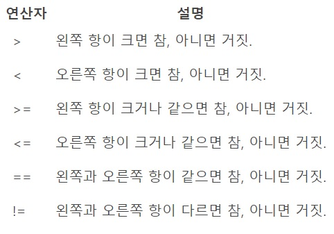

# ☕ JAVA

## 📌 JAVA   
>🌱 JAVA는 썬에서 개발한 객체지향 언어이다. 가정용 단말기에 적용하려는 목적으로 1992년에 만든 '오크(OAK)'언어에서 비롯되었다.     
🌱 오크는 상품화되지 못했지만, 인터넷이 발전하면서 인터넷 진화적인 개발 언어로 방향을 전환하여 1995년 '자바(JAVA)'라는 이름으로 새롭게 소개되었다.   
🌱 현재 자바는 IT 기술 전반에서 가장 널리 사용되는 프로그래밍 언어가 되었다.

## 📌 JAVA 가상머신   
>🌱 JAVA는 '바이트코드(Bytecode)'를 생성한다. 바이트코드는 하드웨어에 종속적이지 않은 중간 파일로, 가상머신을 거쳐 해석.실행하는 구조이다.   
🌱 가상머신으로 자바는 스마트폰, 컴퓨터, Mac, 리눅스 등 서로 다른 기기나 운영체제에서 동일한 프로그램을 개발하고 실행할 수 있다.

## 📌 JAVA Flatform
>🌱 JAVA Flatform은 자바 프로그램이 실행되는 특정 환경을 말한다.      
🌱 여러 제약(화면, 입출력 장치, 성능 등) 때문에 모든 하드웨어나 적용 분야에서 동일한 자바를 사용하는 것은 불가능하다. 각 영역에 특화된 자바 플랫폼이 있다.   
🌱 대표적인 자바 플랫폼 기술로 Java SE(Standard Edition), Java ME(Micro Edition), Java EE(Enterprise Edition), Java Card, Java TV 등이 있다.   
>>💡JDK(Java Development Kit): 자바 프로그램 개발에 필요한 구성 요소   
💡JRE(Java Runtime Environment): 자바 프로그램 실행에 필요한 구성 요소   
💡API(Application Programming Interface): 자바 응용 프로그램 개발에 사용하는 라이브러리

## 📌 JAVA의 장점   
>🌱 간결하면서도 강력한 객체지향 언어이다.   
🌱 개방형 구조로 여러 기술과 융합이 가능하다.   
🌱 플랫폼에 독립적이므로, 여러 운영체제나 하드웨어에서도 동일하게 실행한다.   
🌱 많은 오픈소스 프레임워크로 생산성을 증가하고 유지보수 비용을 절감할 수 있다.

## 📌 JAVA의 단점   
>🌱 처리 속도가 중요한 애플리케이션에는 적합하지 않다.   
🌱 GUI 요소가 많은 MS 윈도우 응용 프로그램 개발에는 적합하지 않다.   
🌱 하드웨어에 연결하여 제어할 수 없기 때문에(가상머신 이용) 직접 하드웨어를 정밀하게 조정해야 하는 프로그램 개발에는 적합하지 않다.

# ☕ JAVA의 기초문법   
📌 변수와 자료형   
>🌱 변수는 프로그램에서 데이터를 저장하는 공간을 말하고, 자료형은 변수에 저장할 데이터의 유형을 말한다.   
🌱 변수 이름 규칙   
>>💡변수 이름 길이에는 제한이 없다.   
💡반드시 문자나 언더바(_), 달러 기호($)로 시작해야 한다.   
💡자바의 연산자(+, -, *, /)는 변수 이름에 넣을 수 없다.   
💡대소문자를 구분한다(int result와 int Result는 다른 변수).   
💡첫 글자에 숫자가 올 수 없고, 이름 사이에 빈칸을 넣어서도 안된다. 빈칸 대신 언더바(_)를 사용한다.   
💡자바의 키워드는 변수 이름으로 사용할 수 없다.

>🌱 자바에서 변수 선언은 명시적으로 데이터형을 지정하게 되어 있으며, 선언된 데이터 유형과 대입된 데이터값에 차이가 있을 때 오류나 오버플로, 언더플로가 발생하므로 주의한다.   
🌱 자바의 변수는 유형에 따라 인스턴스 변수, 클래스 변수, 지역 변수, 파라미터로 구분한다.   
🌱 자바에서 지원하는 기본 자료형(Primitive Data Types)은 크게 정수형, 실수형, 논리형으로 나눈다.    
🌱 캐스팅 : 소괄호 사이에 해석 타입을 명시하여 해석하게 하는 것   
>>💡다운 캐스팅 : 넓은 범위에서 좁은 범위로 해석   
💡업 캐스팅 : 좁은 범위에서 넓은 범위로 해석

# 📌 여러가지 메소드(Method)   
>🌱 메소드 : 코드 묶음을 입력 값을 사용하여 수행할 수 있음    
>>💡호출부 -> 정의부   

>🌱 타입.pasre타입(문자); = 문자열을 정수로 변환하는 메소드    
🌱 타입.toString(숫자) = 정수를 문자열로 변환하는 메소드   
🌱 Scanner    
>>💡Import java.util.Scanner; : 프로그램 첫 행에 다음을 추가해 Scanner 클래스의 경로 이름을 컴파일러에 알림.    
💡Scanner in = new Scanner(System.in); : 키보드로 데이터를 입력 받기 위해 System.in 객체와 연결된 Scanner 객체를 생성.    
💡Int x = in.nextint(); : Scanner 클래스가 제공하는 다양한 메서드를 이용해 키보드로 데이터를 입력 받음. 

>🌱 메소드 호출 방법 = 메소드명(입력값1, 입력값2 ...)제어문 : 프로그램의 흐름에 영향을 주고 때에 따라 제어가 가능하도록 하는 것.    
>>💡즉 실행문의 수행 순서를 변경

## 📌 prinf()의 형식 문자와 자료형   


## 📌 정수형


## 📌 실수형


## 📌 논리형    
    boolean : 1바이트, true값 또는 false 값만 가진다.

📌 연산자    
>🌱 연산자는 프로그래밍 언어에서 사용할 수 있는 다양한 계산식이다.   
🌱 컴퓨터 연산자에는 사칙 연산, 관계 연산, 논리 연산 등이 있다.    
>>💡숫자 연산에서 정수와 정수 연산의 결과 -> 정수	    
💡숫자 연산에서 정수와 실수 연산의 결과 -> 실수

## 📌 연산자 우선 순위


## 📌 산술 연산자


## 📌 관계 연산자


## 📌 논리 연산자


## 📌 비트 연산자


## 📌 분기문   
>🌱 분기문은 프로그램을 개발할 때 논리적 수행을 지원하는 명령어이다.   
🌱 자바에서 지원하는 분기문은 if문과 switch문이 있다.   
🌱 if문은 중첩 사용이 가능하며, if ~ else if ~ else 문 등 응용이 가능하다. switch문은 정수형 뿐만 아니라 문자열 비교로 case별 처리가 가능하다.

```java
if (조건값 1) {
    명령문;
}
else if(조건값 2) {
    명령문;
}
else if(조건값 3) {
    명령문;
}
else {
    명령문;
}
```
```java
if(조건값 1) {
    명령문;
    if(조건값 2) {
        명령문;
    }
}
else {
    명령문;
    if(조건값 3) {
        명령문;
    }
}
```
```java
switch (조건값) {
    case 조건 1:
        명령문;
        break;
    case 조건 2:
        명령문;
        break;
    case 조건 3:
        명령문;
        break;
    default:
        명령문;
        break;
}
```
## 📌 반복문   
>🌱 반복문은 순환문이라고도 하며, 분기문과 함께 프로그램에서 기본적인 로직을 구성하는 기본 문법 중 하나이다.   
🌱 패턴이 일정하여 반복적으로 일을 수행할 때 순환문을 사용하면 쉽게 결과를 확인할 수 있다. 자바 언어에서 지원하는 순환문으로는 for문과 while문이 있다.   
🌱 for문은 시작과 조건, 증감식 등으로 구성된다.
        while문은 조건을 충족하는 동안 계속 수행하는 반복문으로 경우에 따라 do ~ while문의 형태로도 사용이 가능하다.
```java
for (초기값; 조건값; 증감식) {
    명령문;
}
```
```java
while (조건값) {
    명령문;
}

-------------

do {
    명령문;
}
while (조건값)
```
>🌱 메소드 오버로딩 (Method Overloading)
>>💡메소드 이름은 같지만 메소드 시그니처가 다른 메서드를 정의하는 것.